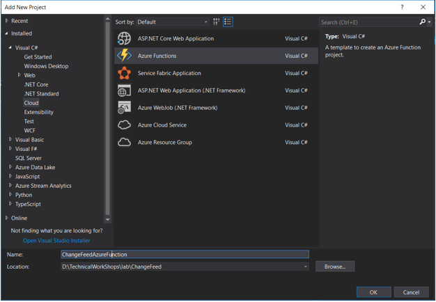
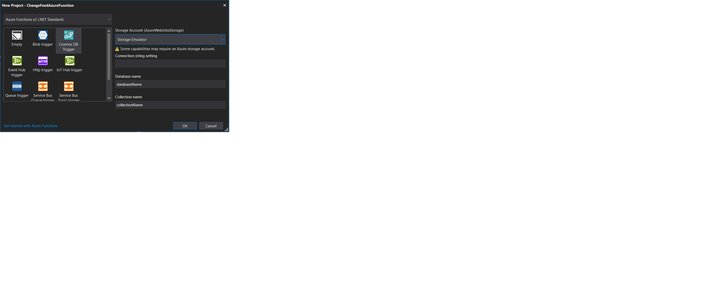
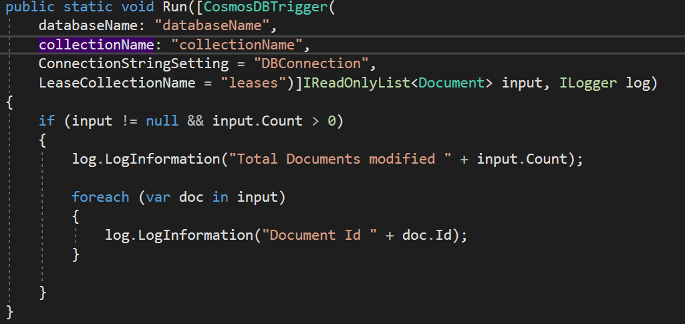

# Prerequisites

**Software**

| Software | Download Link |
| --- | --- |
| Azure Storage Emulator | [/storage-emulator/download](https://docs.microsoft.com/en-us/azure/storage/common/storage-use-emulator) |
| Visual Studio | [/visualstudio.com/download](https://visualstudio.microsoft.com/vs/) |

---

Steps for Creating Cosmos DB Trigger Azure Function:

1. Create Cosmos Trigger Azure Functions:

2. Add the below code to the Run function:

