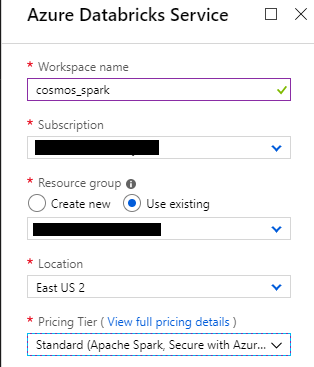
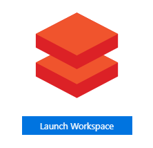
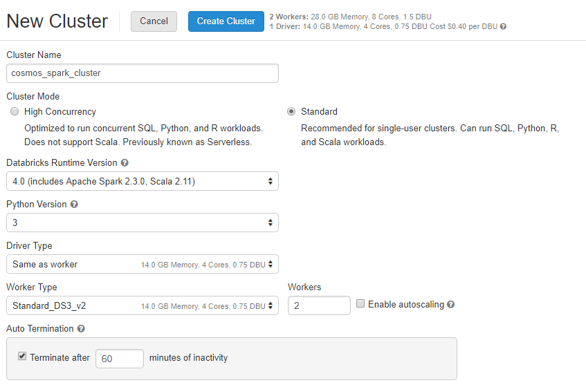
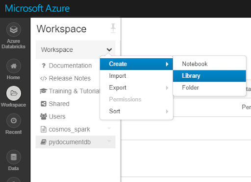
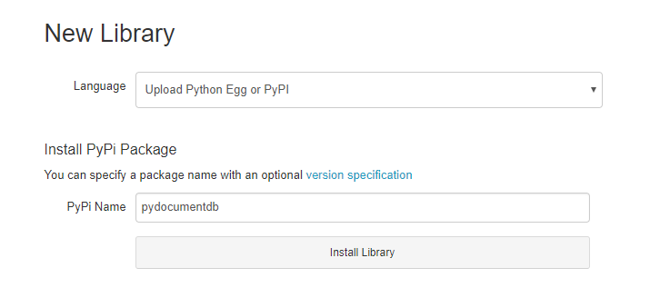
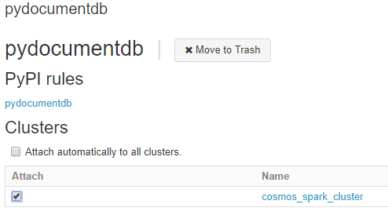

# Apache Spark and CosmosDB Connectors

for more information go to: https://docs.microsoft.com/en-us/azure/cosmos-db/spark-connector

## Resources Required
- Azure CosmosDB 
- Azure Databricks
- Spark Cluster

There are two SDKs that can be used to connect spark to cosmos db:

1. Python SDK (pydocumentdb): Python only, only useful with small datasets
2. Java SDK: Python and/or scala, useful for large data manupulations

## 1. Set up Databricks
Databricks resources cannot yet be allocated through az cli so the setup must be done manually. 
 
Create the databricks resource the azure portal



## 2. Launch workspace from resources



## 3. Create new spark cluster in databricks



## 4. Attach Connector Libraries to Cluster





Do the same for the java SDK using Maven Coordinate ```com.microsoft.azure:azure-cosmosdb-spark_2.3.0_2.11:1.2.0 ```.

Attach both libraries to the cluster



## 5. Import workspace from this repo

**Workspace > Import > Import from url > .../Read_Batch_PyDocumentDB_handson.ipynb**
